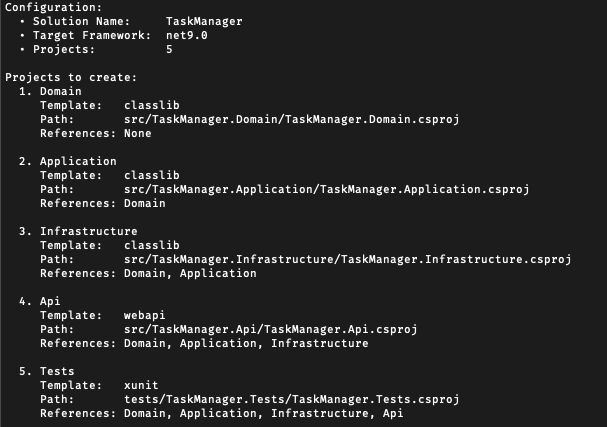
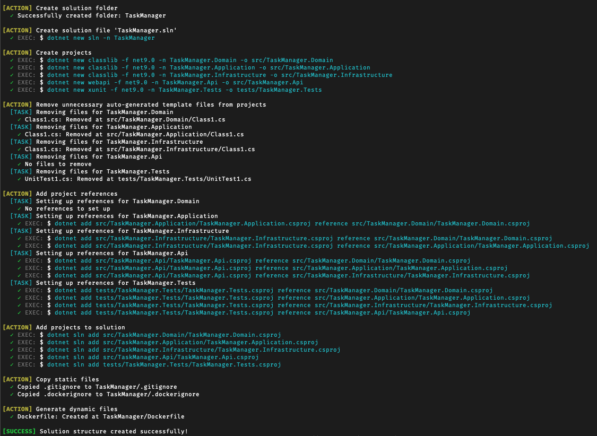

# .NET Multilayer WebAPI Generator (Work in progress)

[](https://opensource.org/licenses/MIT)

A template generator that scaffolds multi-layered .NET Web API solutions with organized project structures and integrated configurations for rapid, enterprise-ready development.

## Features

- Generate a fully structured multi-layer Web API with a predefined configuration using a single command.
- Separation of concerns with distinct project layers.
- Clean code architecture principles.

## Project Structure

This will create a new solution with the following structure:

```
MyNewApi/
├── src/
│   ├── MyNewApi.Domain/
│   ├── MyNewApi.Application/
│   ├── MyNewApi.Infrastructure/
│   └── MyNewApi.Api/
├── tests/
│   ├── MyNewApi.Tests/
├── Dockerfile
├── .gitignore
└── .dockerignore
```

## Solution Architecture

The generated solution follows a clean multilayer architecture:

#### 1. Domain Layer (`MyNewApi.Domain`)
- **Purpose**: The core of the application containing business logic, entities, and rules. This layer is independent of any external concerns (e.g., databases, UI, frameworks).
- **Contents**:
  - **Entities**: Core business objects (e.g., `User`, `Order`).
  - **ValueObjects**: Immutable types that represent concepts (e.g., `Money`, `Address`).
  - **Interfaces**: Abstract definitions for repositories or domain services (e.g., `IUserRepository`).
  - **Exceptions**: Custom exceptions for business rule violations.
- **Dependencies**: None (pure POCO classes).

#### 2. Application Layer (`MyNewApi.Application`)
- **Purpose**: Orchestrates use cases and business logic, acting as a mediator between the Domain and Presentation layers. Defines application-specific services and DTOs.
- **Contents**:
  - **DTOs**: Data Transfer Objects for communication between layers (e.g., `UserDto`).
  - **Interfaces**: Service interfaces (e.g., `IUserService`).
  - **Services**: Implementation of use cases (e.g., `UserService`).
  - **Mappings**: AutoMapper profiles for object mapping.
  - **Behaviors**: Cross-cutting concerns like validation, logging, or CQRS mediators.
- **Dependencies**: Depends on `MyNewApi.Domain`.

#### 3. Infrastructure Layer (`MyNewApi.Infrastructure`)
- **Purpose**: Handles external concerns like database access, file systems, or third-party services. Implements interfaces defined in the Domain/Application layers.
- **Contents**:
  - **Data**: Entity Framework DbContext, migrations, or other data access configurations.
  - **Repositories**: Concrete implementations of repository interfaces (e.g., `UserRepository`).
  - **Services**: External integrations (e.g., email sender, cloud storage).
- **Dependencies**: Depends on `MyNewApi.Domain` and `MyNewApi.Application`.

#### 4. Presentation Layer (`MyNewApi.Api`)
- **Purpose**: The entry point of the application, typically a Web API exposing endpoints to the outside world. Depends on the Application layer to execute use cases.
- **Contents**:
  - **Controllers**: API endpoints (e.g., `UsersController`).
  - **Program.cs/Startup.cs**: Application configuration and dependency injection setup.
  - **appsettings.json**: Configuration files.
- **Dependencies**: Depends on `MyNewApi.Domain`, `MyNewApi.Application` and `MyNewApi.Infrastructure`.

#### 5. Tests Layer (`MyNewApi.Tests`)
- **Unit tests**: For services.
- **Integration tests**: For repositories and controllers.
- **Dependencies**: Depends on `MyNewApi.Domain`, `MyNewApi.Application`, `MyNewApi.Infrastructure` and `MyNewApi.Api`.

## App in Action

**Configuration**: *Displays the initial configuration based on the `solution-config.json` file*
<p></p>

<br>

**Logs**: *Shows a step-by-step log of the solution creation process.*
<p></p>

## Contributing

Contributions are welcome! Please feel free to submit a Pull Request.

## License

This project is licensed under the MIT License - see the LICENSE file for details.

## Acknowledgements

- [ASP.NET Core](https://dotnet.microsoft.com/en-us/apps/aspnet)